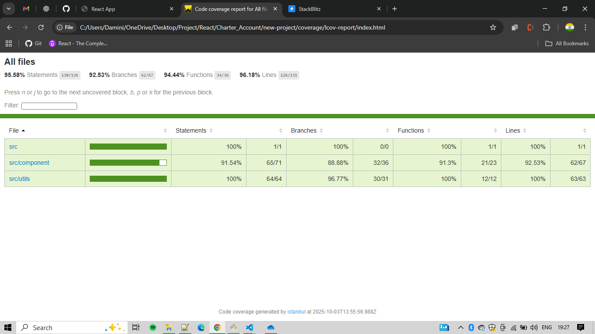

# React Rewards App

A React application to calculate and display customer reward points based on their purchase transactions. Users can filter transactions by date and view rewards in multiple tables.

---

## Features

- Filter customers by **purchase date** using a date picker (last 3 months by default).
- Calculate **reward points** based on transaction amount:
  - 2 points for every $1 over $100
  - 1 point for every $1 between $50 and $100
- Display three tables using Material-UI:
  1. **User Monthly Rewards** – Rewards aggregated per customer per month/year
  2. **Total Rewards** – Total rewards per customer
  3. **Transactions** – Detailed transactions with calculated reward points
- Responsive and clean UI using **Material-UI components**.
- Input validation ensures invalid or empty amounts are ignored.

## Installation

1. Clone the repository:

git clone https://github.com/DaminiKumar/new-project.git
cd new-project
Install dependencies:

npm install

Start the development server:

npm start

The app will run at http://localhost:3000.

# ScreenShots fo Application

## Default 3 months filtered data

## When no customer is found

## When service fails

## Loading state

## Project Structure

public/
└─ customers.json # Sample transaction data

src/
├─ component/
│ ├─ FilteredCustomers.js # Main component with date filter
│ ├─ TableContainer.js # Container for all tables
│ └─ EnhancedTable.js # Reusable table component
├─ utils/
│ ├─ const.js # App constants & table columns
| ├─ date-constans.js # Date constants values
│ ├─ table-data.js # Reward calculation logic
│ └─ logger.js # Logger utility
└─ App.js # Root app component

## Testing

Run all tests with:

npm test

or to run tests in watch mode:

npm test -- --watch

Test Coverage

npm run test:coverage

## Coverage Report

